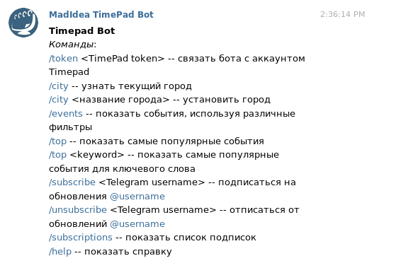
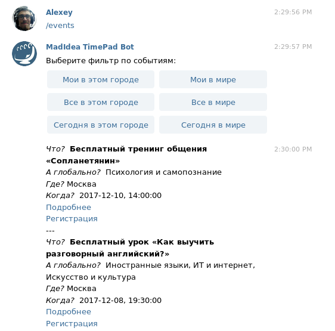

# Madidea TimePad Bot

Madidea TimePad Bot is a Telegram bot that tracks public events (concerts, talks etc.) and prevents you from boredom.


     
Integrated with [TimePad](https://welcome.timepad.ru/) API, it allows you to:

* Subscribe to other TimePad users and get notifications about the tickets they've bought;
* Find the best events (locally or worldwide, today or all-time);
* View the most popular events for a given keyword;
* Remember events that you've planned to visit.

What to do this weekend?

Just ~~ask~~ build this TimePad bot.

## How it works?





## Prerequisites

To build and run the bot, you will need:

* ```python3```
* ```sqlite```
* ```python3 -m pip install -r requirements.txt```
* Register your bot at the [@BotFather](https://web.telegram.org/#/im?p=@BotFather)

To use the bot, you might need:

* (optional) Have an account on [TimePad](https://welcome.timepad.ru/) and get your personal token [here](http://dev.timepad.ru/api/oauth/)

## Usage 

1. Save your TelegramBot token into telegram.token file
2. Run ```python3 database.py``` to init database
3. Run ```python3 main.py``` to start the bot server

## Built by

Madidea Team ( [alexeyqu](https://github.com/alexeyqu), [paulin-mipt](https://github.com/paulin-mipt), [Pitovsky](https://github.com/Pitovsky), [regresscheck](https://github.com/regresscheck) )

## Awards

Won the TimePad track at [MLH LocalHackDay](https://hackday.mlh.io/HSE).

